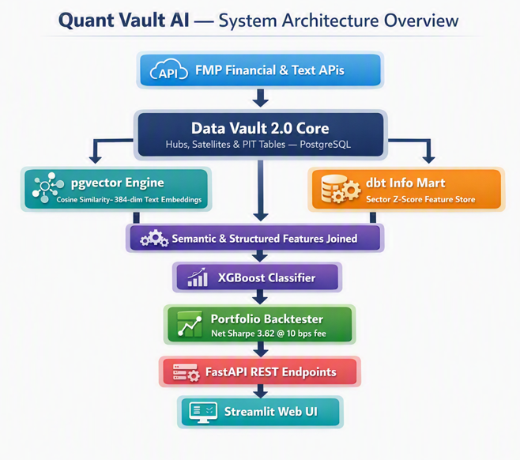

# Quant Vault AI 🚀

> **Architecting a Hybrid Vector Search and Machine Learning Trading Engine**

Quant Vault AI is an end-to-end quantitative trading engine that unifies **Data Vault 2.0** data modeling, **`pgvector`** dense text embeddings, an **XGBoost** relative alpha classifier, and **Prefect** daily post-market orchestration into a production REST microservice.

---

## 1. 🏗️ System Architecture Overview

The system processes raw market data from Financial Modeling Prep (FMP) APIs through an auditable Data Vault foundation, enriches it with semantic vector embeddings, trains a sector-neutral machine learning model, and serves live allocation signals via FastAPI and Streamlit.



---

## 2. 🛠️ Tech Stack & Key Components

* **Data Modeling:** Data Vault 2.0 (`Hubs`, `Satellites`, `PIT Tables`) managed via `dbt` and PostgreSQL.
* **Vector Engine:** `pgvector` storing 384-dimensional text embeddings generated by `SentenceTransformers` (`all-MiniLM-L6-v2`).
* **Machine Learning:** Sector-neutral XGBoost relative alpha classifier trained on cross-sectional feature Z-scores.
* **Orchestration:** Prefect automated daily post-market pipeline (`ingestion` -> `dbt` -> `vectors` -> `inference`).
* **Serving Layer:** FastAPI REST microservice + interactive Streamlit dashboard.

---

## 3. 📊 Performance Summary (Out-of-Sample)

| Metric | Benchmark | Strategy (Gross) | Strategy (Net @ 10bps Fee) |
| :--- | :--- | :--- | :--- |
| **Total Return** | 49.24% | 97.05% | **72.16%** |
| **Sharpe Ratio** | — | 4.76 | **3.82** |
| **Daily Turnover** | — | — | **33.22%** |

---

## 4. � Project Structure

```text
quant-vault-ai/
├── README.md                          # Project documentation
├── requirements.txt                   # Python dependencies
├── Test_Vector_Query.ipynb            # Jupyter notebook for vector query testing
├── train_xgboost.py                   # XGBoost model training script
│
├── api/                               # FastAPI REST microservice
│   └── main.py                        # FastAPI application entry point
│
├── dashboard/                         # Streamlit web dashboard
│   └── app.py                         # Streamlit application entry point
│
├── dbt_project/                       # dbt Data Vault 2.0 project
│   ├── dbt_project.yml               # dbt configuration
│   ├── packages.yml                   # dbt package dependencies
│   ├── macros/                        # dbt macros and helpers
│   ├── models/                        # dbt data models
│   │   ├── stage/                     # Staging layer (source data)
│   │   │   ├── base_fmp_daily_prices.sql
│   │   │   ├── base_fmp_financial_ratios.sql
│   │   │   ├── stg_fmp_daily_prices.sql
│   │   │   ├── stg_fmp_daily_technicals.sql
│   │   │   ├── stg_fmp_financial_ratios.sql
│   │   │   ├── stg_company_text_embeddings.sql
│   │   │   └── src_*.yml
│   │   ├── raw_vault/                # Data Vault raw layer
│   │   │   ├── hubs/
│   │   │   │   └── hub_company.sql
│   │   │   └── sats/
│   │   │       └── sat_company_financial_ratios.sql
│   │   ├── business_vault/           # Data Vault business layer
│   │   │   ├── dim_snapshot_dates.sql
│   │   │   └── pits/
│   │   │       └── pit_company_ratios.sql
│   │   ├── info_marts/               # Info marts (analytics layer)
│   │   │   └── fct_company_quarterly_features.sql
│   │   └── ml/                       # ML-ready feature sets
│   ├── dbt_packages/                  # dbt package dependencies (automate_dv, dbt_utils)
│   ├── logs/                          # dbt execution logs
│   └── target/                        # dbt compiled artifacts
│
├── ingestion/                         # Data ingestion scripts
│   ├── setup_vector_vault.py          # Initialize vector storage
│   ├── load_company_embeddings.py     # Load text embeddings via SentenceTransformers
│   ├── load_daily_prices.py           # Load daily price data from FMP API
│   └── load_financial_ratios.py       # Load financial ratio data from FMP API
│
├── orchestration/                     # Prefect workflow orchestration
│   └── daily_flow.py                  # Daily post-market ETL pipeline
│
├── scripts/                           # Utility and testing scripts
│   ├── query_hybrid_quant.py          # Hybrid vector + structured query example
│   └── test_vector_query.py           # Vector search testing
│
├── logs/                              # Application logs
│
├── assets/                            # Documentation and media assets
│   └── architecture-overview.png      # System architecture diagram
│
└── venv/                              # Python virtual environment
```

### Directory Descriptions

| Directory | Purpose |
| :--- | :--- |
| **api/** | FastAPI REST microservice for serving model predictions and querying embeddings |
| **dashboard/** | Interactive Streamlit web UI for portfolio visualization and performance tracking |
| **dbt_project/** | Data Vault 2.0 transformation models; orchestrated daily via Prefect |
| **ingestion/** | Data pipeline to load market data from FMP APIs and generate embeddings |
| **orchestration/** | Prefect workflows managing daily post-market orchestration (`ingestion` → `dbt` → `vectors` → `inference`) |
| **scripts/** | Utility scripts for testing, queries, and ad-hoc analysis |

---

## 5. �🚀 Quickstart

### Clone & Set Up Environment

```bash
git clone [https://github.com/vrrgithub1/quant-vault-ai.git](https://github.com/vrrgithub1/quant-vault-ai.git)
cd quant-vault-ai
python -m venv venv
source venv/bin/activate  # On Windows: venv\Scripts\activate
pip install -r requirements.txt
```

### Configure Environment Variables

Create a .env file in the root directory:

```code snippet
DB_USER=postgres
DB_PASSWORD=your_password
DB_HOST=localhost
DB_PORT=5432
DB_NAME=quant_vault_db
FMP_API_KEY=your_fmp_key
```

### Run dbt Transformations

```bash
dbt run
```

### Launch Application Services

* **FastAPI Backend:** uvicorn app.main:app --reload

* **Streamlit UI:** streamlit run app/dashboard.py

* **Prefect Flow:** python orchestration/daily_flow.py

## 6. 📖 Related Article

Read the full deep-dive architectural breakdown on Medium:

👉 Quant Vault AI: Architecting a Hybrid Vector Search and Machine Learning Trading Engine
